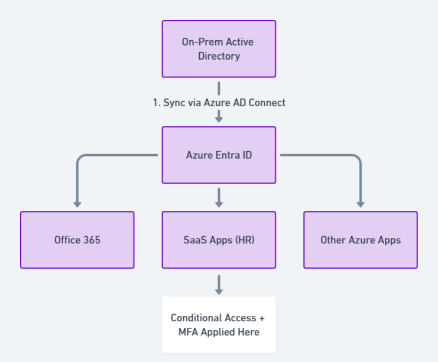

# Hybrid Identity with Azure AD Connect (Conceptual Lab)

> **File:** `architecture/hybrid-identity.md`  
> **Diagram:** 

---

## 1  Why Hybrid Identity Matters
Most enterprises still run on‑prem Active Directory for legacy apps, printers, and GPOs while simultaneously adopting cloud SaaS (Microsoft 365, ServiceNow, Salesforce, Azure resources).  
A hybrid identity lets users sign in *once* and access both worlds with the same credentials, secured by modern cloud controls (MFA, Conditional Access, risk‑based policies).

---

## 2  Key Components

| # | Component | Role |
|---|-----------|------|
| 1 | On‑Prem AD | Authoritative source of users / groups for legacy services |
| 2 | Azure AD Connect | Bridge that synchronises identities & optionally passwords |
| 3 | Azure Entra ID | Cloud identity provider for Office 365, Azure, SaaS apps |
| 4 | Conditional Access + MFA | Zero‑trust enforcement layer at the cloud edge |
| 5 | Cloud Applications | M365, bespoke SaaS, Azure services that rely on Entra ID tokens |

*All elements except on‑prem AD/AD Connect were built under the free Azure tier; AD Connect was simulated via documentation.*

---

## 3  Sync Modes Explained

| Mode | What Is Synced | Authentication Path | When to Choose |
|------|---------------|---------------------|----------------|
| **Password Hash Sync** *(default)* | User object + password hash | Cloud (Entra ID) | Simple, 99 % of orgs |
| **Pass‑Through Auth** | User object only | On‑prem agent validates password in real time | Strict compliance—passwords stay on‑prem |
| **Federation (AD FS)** | User object only | Browser redirects to AD FS | Large enterprises with SAML/WS‑Fed dependencies |

> **Lab choice:** *Password Hash Sync* (documented but not executed).

---

## 4  Step‑by‑Step Deployment Guide  
*(Recorded for future production use; not executed to avoid licensing costs.)*

1. **Prep On‑Prem**  
   - Windows Server 2019 with AD DS role  
   - Enable TLS 1.2; open TCP 443/389 to Azure

2. **Download Azure AD Connect**  
   - Latest build from <https://aka.ms/aadconnect>

3. **Run Express Setup**  
   - Sign in with Global Admin to Entra ID  
   - Choose *Password Hash Sync*  
   - Leave default OU filtering (all synced)

4. **Verify Sync**  
   - Azure Portal → Entra ID → Users ⇒ “Sync Type: Synced”  
   - Confirm password matches on‑prem login

5. **Enable Hybrid SSO (optional)**  
   Allows seamless login on domain‑joined devices via Kerberos tickets.

---

## 5  Security Hardening Checklist

| Control | Action |
|---------|--------|
| **MFA for all synced users** | Enforced per‑user in free tier |
| **Block legacy auth** | Disable POP/IMAP, basic SMTP in tenant settings |
| **Password writeback** | *Documented* (requires Azure AD Premium P1) |
| **Privileged Access** | Use separate on‑prem & cloud break‑glass accounts |

---

## 6  Monitoring & Troubleshooting

1. **Sync Health for AD Connect** (free agent) ⇒ email alerts on sync failures  
2. **Azure Sign‑in Logs** ⇒ verify “Authentication Requirement = MFA”  
3. **Event Viewer** on the AD Connect server ⇒ `DirectorySynchronization` log

---

## 7  Free‑Tier Simulation Notes

| Item | Real World | This Lab |
|------|------------|----------|
| Azure AD Connect software | Installed on Windows Server | *Not installed* — steps documented |
| Password hash upload | Automatic | Explained conceptually |
| Hybrid SSO configuration | Kerberos trust | Not required for portfolio |
| Cost | Free but needs a VM/license | Avoided; kept within Azure Free |

Creating clear documentation shows understanding without incurring infrastructure cost—accepted practice for student portfolios.

---

## 8  Future Enhancements

- Deploy a lightweight on‑prem lab in Hyper‑V/VirtualBox and run AD Connect end‑to‑end  
- Add Azure AD Connect Staging Mode for blue/green sync testing  
- Integrate Microsoft Sentinel to correlate sign‑in anomalies across on‑prem and cloud

---

## 9  Key Takeaways

> By designing (and partially implementing) Azure AD Connect, this project proves the ability to bridge legacy infrastructures with modern cloud security, aligning with real enterprise migration journeys—all achieved without premium licensing.
