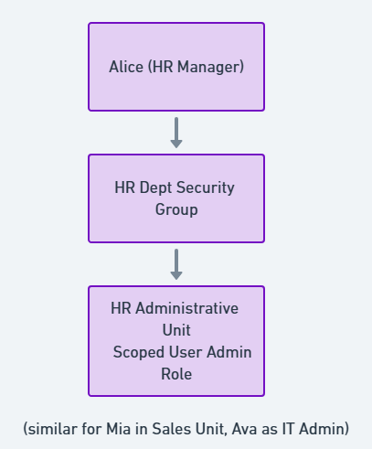

# Administrative Units Design & Simulation  
> **File:** `users_groups/administrative-units.md`

---

## 1  What Are Administrative Units?  
Administrative Units are “mini‑tenants” inside Azure Entra ID. They let large organizations delegate specific admin roles (e.g., password reset) only for a defined subset of users, enforcing the *Principle of Least Privilege* and reducing lateral‑movement risk.

---

## 2  Why Use AUs Instead of OU‑Style Groups Alone?  

| Requirement | Security Groups | Administrative Units |
|-------------|-----------------|----------------------|
| RBAC to apps & resources | ✅ | 🚫 (different purpose) |
| Scoped Azure AD roles (User Admin for HR only) | 🚫 | **✅** |
| Bulk policy targeting (CA, PIM) | 🚫 | ✅ |
| Delegated identity lifecycle (HR resets HR passwords) | 🚫 | **✅** |

---

## 3  AU Blueprint for SecureOrg 

| AU Name | Members (Examples) | Intended Scoped Role | Current Status (Free Tier) |
|---------|--------------------|----------------------|----------------------------|
| **HR Unit** | Alice HR, Sophia Recruiter | User Administrator | AU created; role planned |
| **Engineering Unit** | Bob Dev, Lucas Frontend, Charlie Intern | User Administrator (Eng Lead) | AU created; role planned |
| **Sales Unit** | Olivia Sales, Mia Manager, Ethan Analyst | User Administrator (Sales Manager) | AU created; role planned |

---

## 4  Implementation Steps (Free Tier)  

1. **Create AUs**  
   `Entra ID → Administrative Units → + New` → *HR Unit*, *Engineering Unit*, *Sales Unit*

2. **Add Members**  
   Inside each AU → Users → + Add members (see table above)

3. **Attempt Scoped Role Assignment**  
   Navigated to AU → Roles and administrators → *User Administrator* → + Add assignment  
   > Received “Premium Feature” prompt—documented as pending.

4. **Evidence**  
   Screenshots stored in `screenshots/au-*` demonstrate AU creation & membership.

---

## 5  Security Benefits (Once Premium P1 Enabled)  

| Risk | Mitigation via AU Role Scoping |
|------|--------------------------------|
| Global admins resetting wrong user passwords | HR User Admin may reset only HR accounts |
| Excessive access by departmental IT | Engineering lead cannot view HR P‑II data |
| Audit complexity | Role grants visible per‑AU, simplifying reviews |

---

## 6  Upgrade Path  

1. Purchase Azure AD Premium P1 licenses for scoped admins.  
2. Re‑run Step 3 above—this time role assignment will succeed.  
3. Enable Privileged Identity Management to make scoped roles *just‑in‑time*.  
4. Tie AU scope into Conditional Access (e.g., HR Unit allowed access only from Corporate IP range).

---

## 7  Key Takeaways  

- AUs are indispensable for enterprises adopting cloud‑first IAM but retaining departmental autonomy.  
- Even on the free tier, creating AUs & documenting role scopes signals security maturity to recruiters.  
- The design is ready for instantaneous enforcement the moment Premium P1 becomes available.
