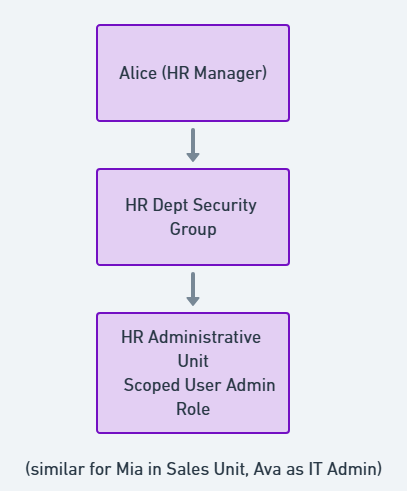

#  User & Group Structure  
> **File:** `users_groups/user-structure.md`  
> **Tenant:** *SecureOrg Azure Entra ID* | **Created:** April 2025

---

## 1  Design Goals

| Objective | Rationale |
|-----------|-----------|
| **Mirror a real 3‑department company** | Demonstrates practical IAM modelling |
| **Support role‑based access control** | Drives least‑privilege & clean authorization |
| **Enable delegated admin via Administrative Units** | HR and Sales manage their own people |
| **Prepare for Conditional Access policies** | Time‑based, geo‑based, and risk‑based rules require clear group targets |

---

## 2  Users (10 Total)

| UPN / Alias | Display Name | Department | Role                           | Account Type |
|-------------|--------------|------------|--------------------------------|--------------|
| `alice@…`   | Alice HR     | HR         | **HR Manager** (privileged)    | Member |
| `sophia@…`  | Sophia Recruiter | HR     | HR Specialist                  | Member |
| `bob@…`     | Bob Developer| Engineering| Backend Developer              | Member |
| `lucas@…`   | Lucas Frontend| Engineering| Frontend Developer             | Member |
| `charlie@…` | Charlie Intern| Engineering| Engineering Intern             | Member |
| `olivia@…`  | Olivia Sales | Sales      | Sales Representative           | Member |
| `mia@…`     | Mia Manager  | Sales      | **Sales Manager** (privileged) | Member |
| `ethan@…`   | Ethan Analyst| Sales      | Sales Intern                   | Member |
| `ava@…`     | Ava ITAdmin  | IT         | **Global Administrator**       | Member |
| `vendor@…` | Vendor Account | External | Third‑party Support Engineer | **Guest** |

> **Password Management:** Auto‑generated, rotated post‑lab, MFA enforced tenant‑wide.

---

## 3  Security Groups

| Group Name | Membership | Purpose / Target |
|------------|------------|------------------|
| **HR Dept** | Alice, Sophia | SharePoint HR portal, HR apps |
| **Engineering** | Bob, Lucas, Charlie | Code repos, dev VMs |
| **Sales** | Olivia, Mia, Ethan | CRM, pipeline dashboards |
| **Managers** | Alice, Mia | Elevated permissions, manager reports |
| **Interns** | Charlie, Ethan | Limited rights; Conditional Access time lock |
| **Full‑time** | All non‑intern employees | Benefits portal |
| **IT Admins** | Ava | Break‑glass & PIM eligibility |
| **Guests** | Vendor | Vendor ticketing portal |

All resource assignments use **groups only**—no direct user→app grants.

---

## 4  Administrative Units (AUs)

| AU | Included Users | Planned Scoped Role |
|----|----------------|---------------------|
| HR Unit | Alice, Sophia | User Administrator |
| Engineering Unit | Bob, Lucas, Charlie | User Administrator (future) |
| Sales Unit | Olivia, Mia, Ethan | User Administrator |

> Scoped roles require Azure AD Premium P1—documented for future enforcement.

---

## 5  RBAC Overview

**Managers** receive elevated app permissions but not tenant‑wide admin roles.  
**Interns** inherit read‑only rights and are bounded by Conditional Access (9 AM–6 PM EST design).  
**Guest** accounts always require MFA and are reviewed every 90 days.

---

## 6  Lifecycle Processes

| Phase | Trigger | Responsible Role | Tool / AU |
|-------|---------|------------------|-----------|
| Onboarding | New hire in HRIS | HR Manager | HR Unit |
| Role Change | Promotion to manager | Dept. Manager | HR/Eng/Sales AU |
| Offboarding | Termination notice | HR Manager + IT Admin | HR Unit + IT Admins |

---

## 7  Takeaways

1. Enterprise Realism: 3 departments, privileged vs. standard, guests & interns.  
2. Security by Design: All future CA and MFA rules target clear groups.  
3. Ready for Scale: AU framework allows immediate premium upgrade without redesign.
